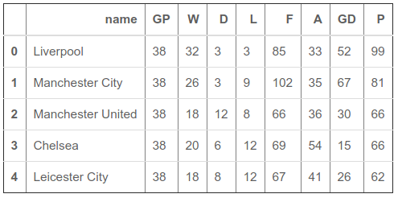

## The 'ins' and 'outs' of data

* We've learned how to work with CSV files - which are probably the most common data format you'll come across
* What if your data aren't available in CSV format?  
* Possible formats: Excel, database, fixed-width text, statistics packages, JSON, XML, ...

---

### `pd.read_csv()`

* Also: `pd.read_table()`
* Designed for __delimited__ text data
* Lots of options!


---

### Delimited text data

* Generally: each record on a different line of the text file; columns separated in some consistent way (hopefully)
* Common delimiters: 
    * Comma `','`
    * Semi-colon `';'`
    * Pipe `'|'`
    * Tab (expressed as `'\t'` in `pandas`)
* Supplied to the `sep` parameter in `read_csv()`; defaults to comma

---

### Fixed-width text files

* Each column in the text file a specified (fixed) number of characters; generally, a data dictionary will specify the column widths
* Read into `pandas` with the `read_fwf()` function; supply a list of column widths to the `widths` parameter


---

### Excel files

* Accessible via the `read_excel()` function in `pandas`

---

### Data on the web

* Example: https://data.fortworthtexas.gov/

---

### Application programming interfaces (APIs)

* API (general definition): the way in which you can access a particular software application programmatically
    * For example: the `pandas` API comprises the functions, methods, etc. that you use in `pandas`
* Data API: interface that allows you to access __data__ programmatically
    * Often: requests are made via URL; interact with data via URL parameters
    

---

### JavaScript Object Notation (JSON)

* Example: https://data.fortworthtexas.gov/resource/kr8h-9zxd.json

---

### JSON in `pandas`

* Convert JSON to data frames with the `read_json()` function
* Be careful with what you get back!

```python
import pandas as pd

api_call = 'https://data.fortworthtexas.gov/resource/kr8h-9zxd.json?streetname=BERRY'

berry = pd.read_json(api_call)

berry.head()

```

---

### Why use APIs? 

* Your programming knowledge can give you even more flexibility...

```python
def get_accidents(street_name): 
    part1 = 'https://data.fortworthtexas.gov/resource/kr8h-9zxd.json?streetname='
    api_call = part1 + street_name
    return pd.read_json(api_call)

uni = get_accidents('UNIVERSITY')

uni.head()
```

---

### Data on websites


---

### Web scraping

* Process of getting data __from__ websites __into__ your computing environment 
* Python packages to accomplish this: `html5lib`, `BeautifulSoup`, `lxml`, `scrapy`
* Web scraping built into `pandas` with the `read_html()` function (for tables)
    * "Expect to do some cleanup after you call this function."
    

---

### Web scraping in `pandas`

```python
url = 'https://www.espn.com/soccer/standings/_/league/ENG.1/season/2019'

epl = pd.read_html(url)

epl
```

We get back a list of data frame objects with team names (with clean-up required) in the first data frame and team performance in the second

---

## Regular expressions

<figcaption>[Image source](https://www.commitstrip.com/en/2016/04/08/fing-patterns/)</figcaption>

---

```python
teams = epl[0]

teams["name"] = teams["2019-2020"].str.replace("[0-9]", "")

teams[6:12]
```


---

* `np.where()`: If the specified condition is `True`, return the first supplied outcome; otherwise return the second supplied outcome

```python
import numpy as np

teams["firstfive"] = teams["name"].str[0:5]

teams["name"] = np.where(teams["firstfive"].str.isupper(),
                         teams["name"].str[4:], 
                         teams["name"].str[3:])

```

---

```python
teams[6:12]
```


---

```python
teams.drop(["2019-2020", "firstfive"], axis = 1, inplace = True)

teams.head()
```


---

### Combining data frames by position

* The `concat()` function in __pandas__: stitches together data frames vertically (`axis = 0`) or horizontally (`axis = 1`); relies on row/column indices rather than key field value

```python
epl_cleaned = pd.concat([teams, epl[1]], axis = 1)

epl_cleaned.head()
```



---

### Explore your data!

```python
import seaborn as sns
sns.set(style = "darkgrid")

sns.lmplot(data = epl_cleaned, x = "A", y = "P")
```


---

```python
sns.barplot(x = "F", y = "name", 
            data = epl_cleaned.sort_values("F", ascending = False))
```


---

### Getting data out

* The `.to_xxx()` suite of methods allow you to write `pandas` data frames to a host of different formats

For example: 

```python
epl_cleaned.to_csv('epl_standings.csv', index = False)
```

<style>

.reveal section img {
  background:none; 
  border:none; 
  box-shadow:none;
  }

h3 {


}
  
</style>

