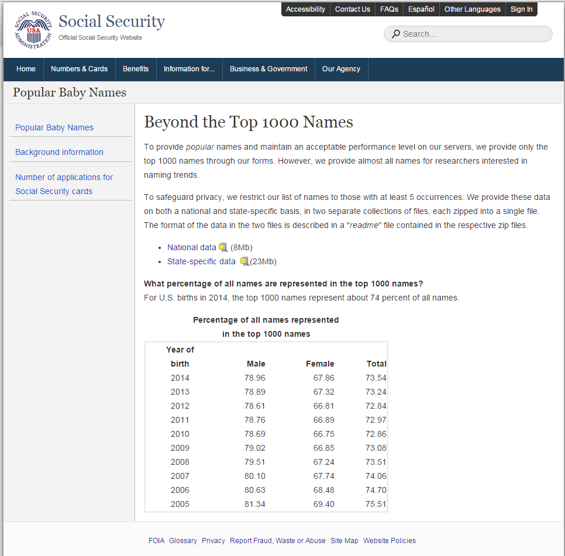
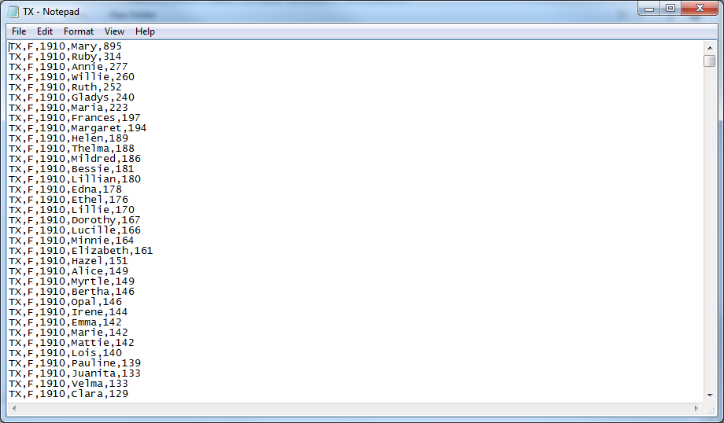
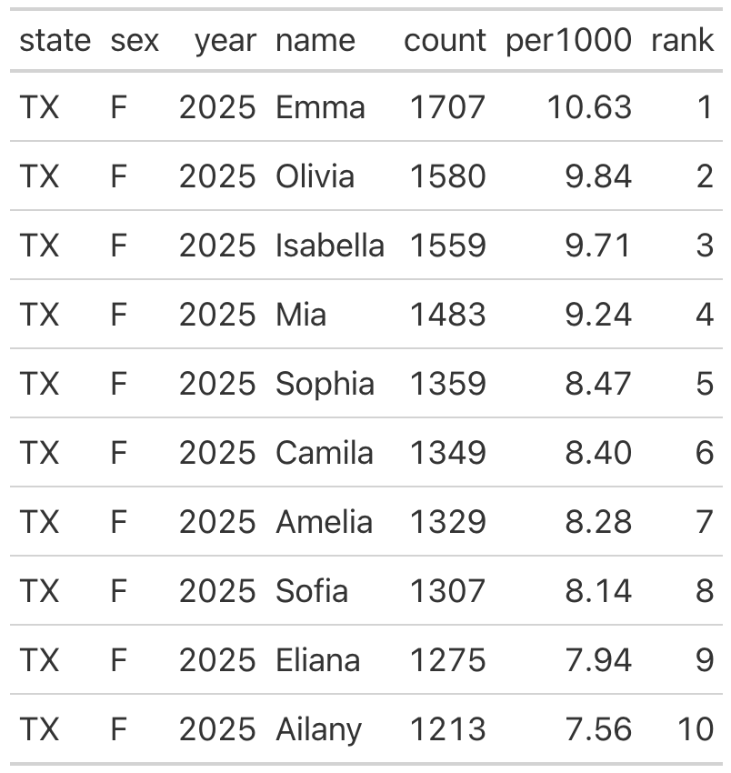
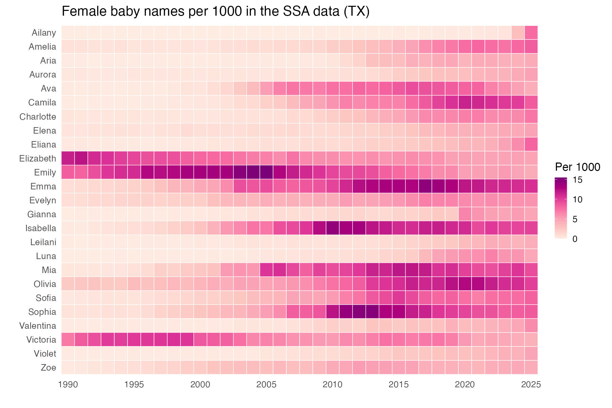
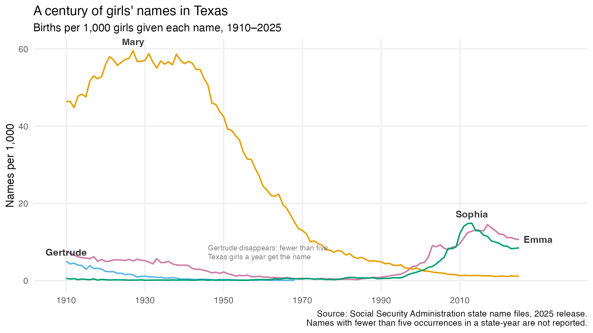
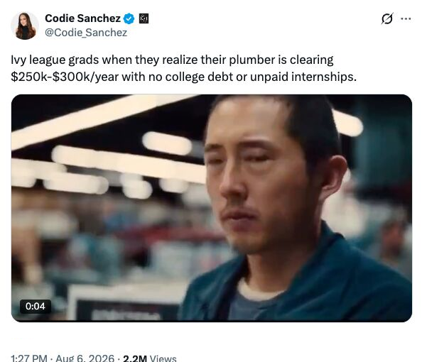
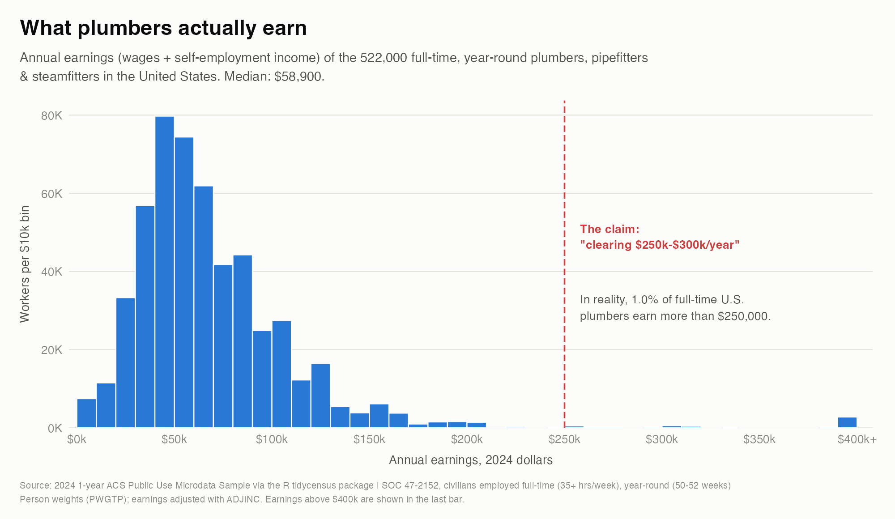
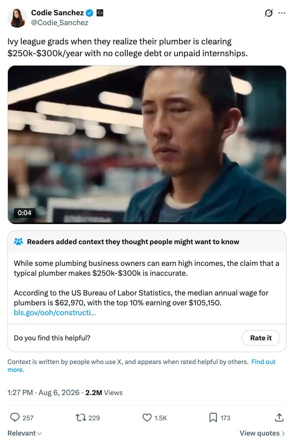
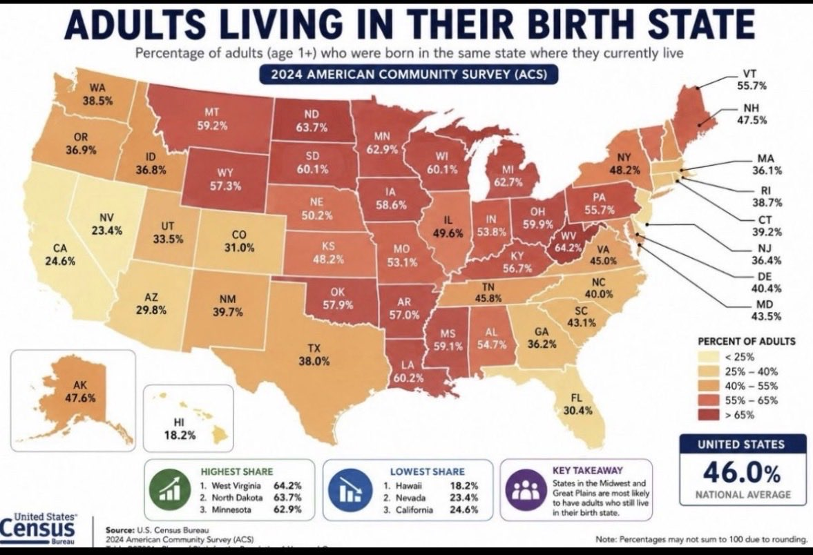

## Introductions

---

## Course goals

---

## Syllabus

# Why data analysis and visualization?

---

## Brainstorm: how might you use data if you were...

-   ...an oil and gas landman?
-   ...a real estate broker?
-   ...a TCU athletics department staffer?
-   ...a social media influencer?

---

## What you will learn in this course

This course covers the process of **exploratory data analysis**, which includes how to:

::: {.incremental}
-   Find data
-   Load data
-   Clean data
-   Summarize data
-   Visualize data
-   Present data
-   Example question: what are the most popular female baby names in Texas, and how has this changed over time?
:::

---

## Finding data

<figcaption>Source: [Social Security Administration](http://www.ssa.gov/oact/babynames/limits.html)</figcaption>

---

### Loading and cleaning data

---

## Summarizing data

---

## Visualizing data

---

## Presenting data

---

## Data science

<figcaption>Source: [*The Onion*](http://www.theonion.com/article/amazoncom-recommendations-understand-area-woman-be-2121)</figcaption>

# Data Literacy

---

## From your feed

---

### 2.2 million views. Is it true?

Discuss:

::: {.incremental}
-   What exactly is she claiming here?
-   Who benefits if you believe it?
-   What data could prove this one way or another?
:::

---

## What plumbers actually earn

---

### What the data says

::: {.incremental}
-   The median full-time U.S. plumber earns about \$59,000
-   1 percent of full-time plumbers earn more than \$250,000
-   A claim can be true of *someone* and still be incorrect, which we see by visualizing the overall distribution
:::

---

### The crowd ran the same check

## Viral maps on social media

---

### Millions of views, but is it true?

Discuss:

::: {.incremental}
- Do you think this map is accurate?
- Why, or why not?
:::

---

### Information is plentiful, understanding is scarce

::: {.incremental}
-   Confident, professional-looking claims have never been cheaper to produce
-   But deep understanding of how to verify those claims is still immensely valuable
-   In this course, we'll work on developing that judgment.
:::

---

## Google CoLab

-   [Google Colaboratory](https://colab.research.google.com/): our tool for using Python in the cloud
-   Let's explore...
