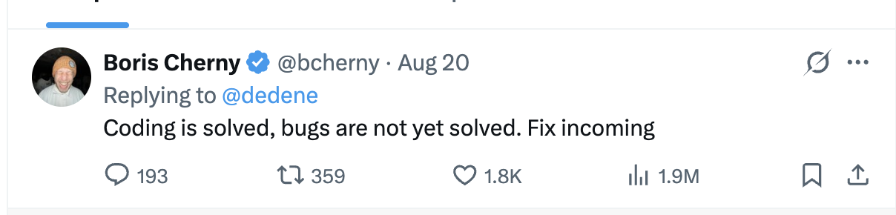
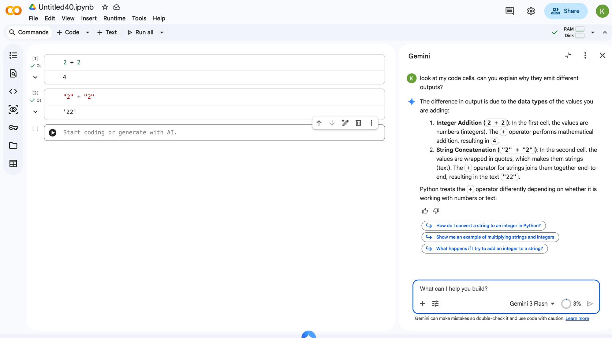

## Why code?  

## For discussion

There's a lot of talk about AI right now.  What have you heard about:

* AI and coding / coding jobs? 
* AI and jobs in your field, in general?

## Didn't AI solve coding?

::: {.incremental}
* "It is our job to create computing technology such that nobody has to program... the programming language is human." — Jensen Huang, CEO of Nvidia (Feb 2024)
* "We'll be there in three to six months, where AI is writing 90 percent of the code. And then in twelve months, we may be in a world where AI is writing essentially all of the code." — Dario Amodei, CEO of Anthropic (Mar 2025)
:::

## From the creator of Claude Code:



## Read it the way you read the plumber tweet

::: {.incremental}
* If bugs are not yet solved... what exactly got solved?
* __Typing__ is solved: producing code that _looks_ right
* Knowing whether the code __is__ right?  Not solved.  (That's this course.)
:::

## Determinism

* _Determinism_: metaphysical view that events can only take place one certain way
* _Deterministic process_: a process that executes identically each time it runs
* Code is _deterministic_; human language is not

## So, why use code for data analysis?

::: {.incremental}
- Automation
- Documentation and reproducibility
- Logical organization
- Systems design
:::

## More specifically, why do _you_ need to learn code?

> If you want to be lazy, you can be more lazy with less effort than at any other time in human history; you can solve problems with zero intellectual engagement. But you don’t have to do that, because AI can also amplify the best of you. You can use it to go deeper, to engage more in any of the domains that you’re working in.

- Wickham - <https://tidydesign.substack.com/p/y-code-when-ai>

## What Amodei actually said

<iframe id="amodei-clip" width="900" height="506" frameborder="0" allowfullscreen></iframe>

```{=html}
<script>
(function () {
  var f = document.getElementById("amodei-clip");
  if (f) f.src = "https://www.youtube.com/embed/esCSpbDPJik?" + "start=963&end=1029";
})();
</script>
```

## Your advantage: understanding the process

* Them: using AI to produce outcomes with no understanding of the process
* You have access to the same AI tools as them.  But you:
  * Understand the code that AI is using to build the outcomes
  * Have the knowledge to direct AI to use better, newer, and more efficient tools
  * Can build with AI and build expertise as a result

## Some examples

## Python

::: {.incremental}
* Python is by far the most popular programming language in the world
* It's arguably the easiest language for beginners to understand
* In most cases, coding agents default to it - so you'll learn to speak their language
:::


## Why Python? (XKCD)

<figcaption>Source: [Randall Munroe/XKCD](https://xkcd.com/353/)</figcaption>

## Other options for data analysis

                                             

* R (<https://www.r-project.org/>): programming language for statistics, data analysis, and much more (and a personal favorite of mine)
* Julia (<http://julialang.org/>): relatively new language for technical computing that aims for high-level syntax and C-like speed

---

## Google Colaboratory

* Cloud-based platform for hosted Jupyter Notebooks that connects to your Google account & Google Drive.
* Let's try it out!  <https://colab.research.google.com/>

---

### Literate programming

As defined by Donald Knuth: 

> Literate programming is a methodology that combines a programming language with a documentation language... The main idea is to treat a program as a piece of literature, addressed to human beings rather than to a computer.

* Source: <http://www-cs-faculty.stanford.edu/~uno/lp.html>

---

### Markdown

* Tool to convert plain text to HTML; used for literate programming in the Colab Notebook

Example: 

```
_This link_ is __truly__ must-see: [click here to view it!](http://personal.tcu.edu/kylewalker/)
```

_This link_ is __truly__ must-see: [click here to view it!](http://personal.tcu.edu/kylewalker/)

---

### Sage words before we get started...

> "You're doing it right if you get frustrated: if you're not frustrated, you're (probably) not stretching yourself mentally"

* — Hadley Wickham, February 2015 (Twitter)

---

### Numbers and strings

* At a basic level, Python can function like a calculator, or concatenate strings: 

```python
2 + 3
# 5

'x' + 'y'
# 'xy'

```

* _Object type_: the way in which the object is stored (e.g. float, integer, string)
* Python is a _dynamically typed_ language, which means that you don't need to explicitly supply the object type

---

### Predict: what does this return?

```python
'2' + '3'
```

---

### The result

```python
'2' + '3'
# '23'
```

* __Silent error__: code that runs without complaint, but does the wrong thing

---

### Errors in Python

```python
'a' + 4
# TypeError: can only concatenate str (not "int") to str
```

---

### Using AI the right way: ask it to explain



---

### Ask _why_, not just _what_

::: {.incremental}
* Don't just ask AI for the answer. Ask it to explain output you already have
* "Look at my code cells.  Can you explain why they emit different outputs?"
* Use this class as an opportunity to understand the process
:::

---

### Variables

* In programming, a __variable__ is a reference to some other sort of information or quantity
* Variables are created through _assignment_

Example: 

```python
x = 1
x
# 1
```

---

## Strings

* Strings, or textual representations of data, have a series of special methods that allow for their manipulation

Example: 

```python
tcu = 'Texas Christian University'
tcu.swapcase()
# 'tEXAS cHRISTIAN uNIVERSITY'
```

---


## Lists

* Data structure in Python for storing multiple values; enclosed in brackets `[]`
* List elements do not need to all be of the same type (though you'll often want them to be)

Example list: `mylist = [2, 4, 6, 8, 10, 12]`

---

### Indexing and slicing

* Elements in Python can be accessed by position using __indexing__; covers characters in strings, objects in lists, and much more
* Python indexing starts at 0 - meaning that the first element is referenced with `0`, the second with `1`, and so forth
* __Slicing__: extract subset `a:b` starting with position `a` up to __but not including__ position `b`

---

### Indexing and slicing 

Example: 

```python
tcu[0]
# 'T'
tcu[6:15]
# 'Christian'
```

## Assignment 1: let's take a look


<style>

.reveal section img {
  background:none; 
  border:none; 
  box-shadow:none;
  }
  
</style>
