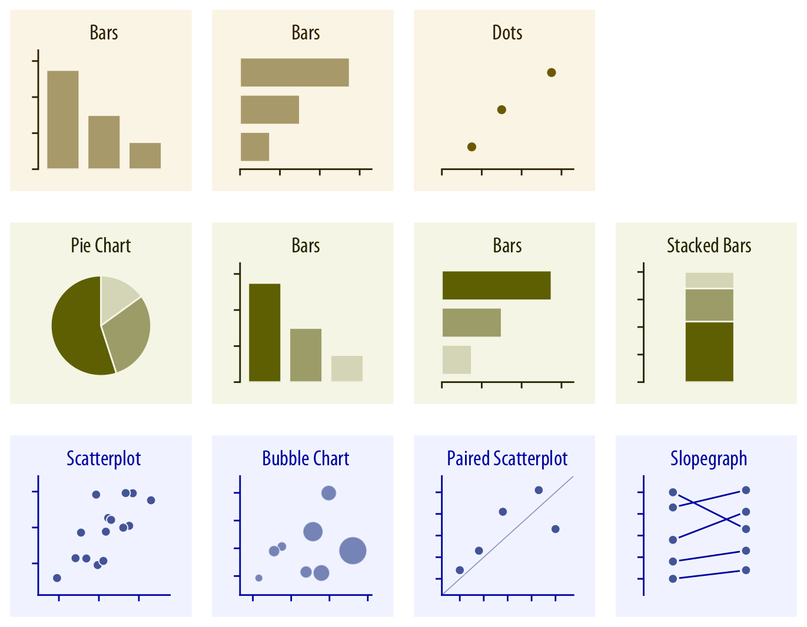
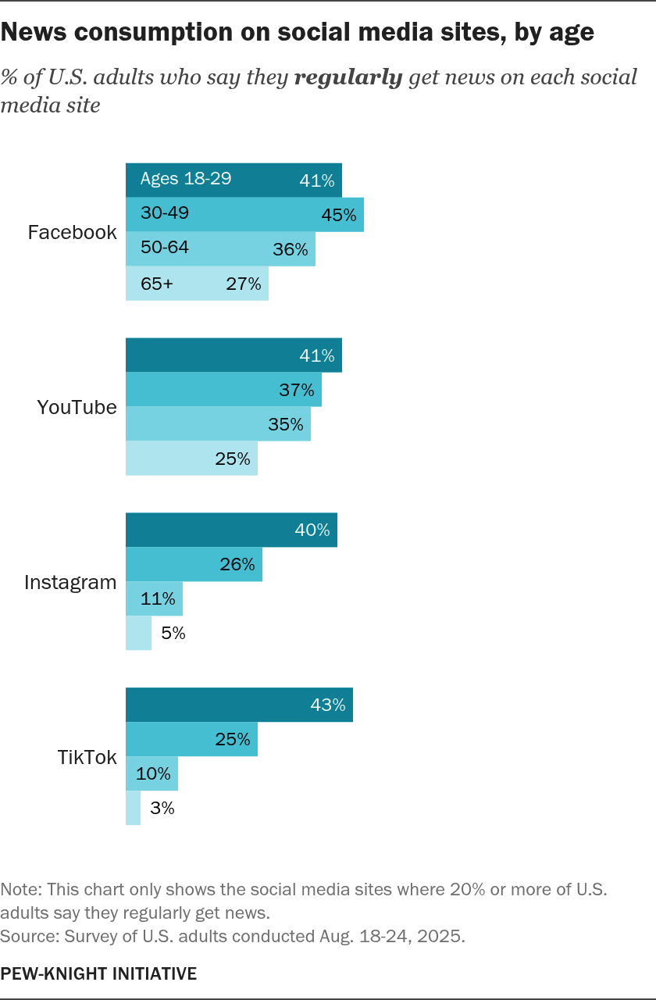
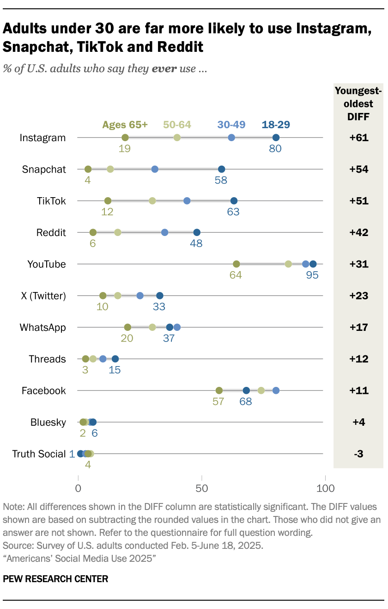
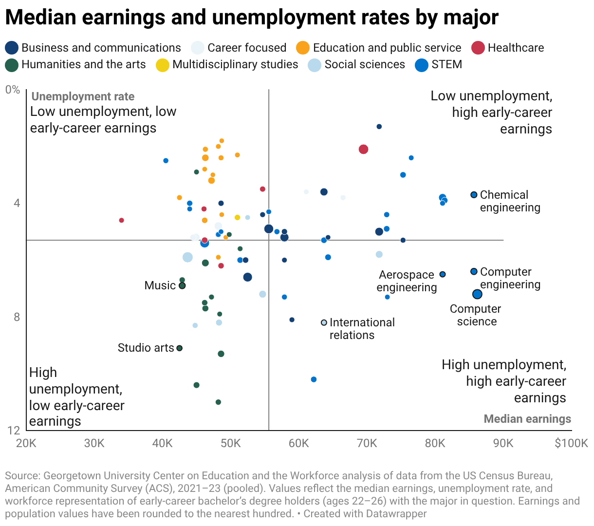

## Why visualize data?  

> The greatest value of a picture is when it forces us to notice what we never expected to see.  

* Tukey (1977) quoted in Yau (2013)

---

### Exploring data visually

<div style="text-align: center;"><figcaption>Source: Wilke, [_Fundamentals of Data Visualization_](https://clauswilke.com/dataviz/directory-of-visualizations.html), Ch. 5 (CC BY-NC-ND)</figcaption></div>

---

## Our schedule: 

* Current activities: data exploration through visualization with common chart types
* Weeks 11-13: deep dive into data visualization
    * More complex chart types
    * How to customize your `seaborn` plots
    * Best practices in data visualization
    * Interactive web-based graphics
    * Maps!

---

### Exploratory chart types

* Comparing categories: __bar chart__, __dot plot__
* Part-to-whole: __pie chart__
* Change over time: __line chart__
* Connections and relationships: __scatter plot__

Many, many more in these categories - these are just our focus for today!

---

### Python and the web

* A brief aside: With Python, data on the web is at your fingertips (our topic for Week 10)
* This week, you will get a preview

```python
import pandas as pd

mx_csv = "https://raw.githubusercontent.com/walkerke/geog30323/main/data/mexico.csv"
mx = pd.read_csv(mx_csv)
mx.head()
```

```
                  name  gdp_pc  gdp_growth   pri   sec   ter  other  pct_65plus
0       Aguascalientes   214.5        -1.9   4.3  30.3  64.7    0.7         7.2
1      Baja California   233.5         0.3   5.2  29.5  61.4    3.9         7.1
2  Baja California Sur   211.8         3.8   5.9  18.8  74.8    0.5         6.6
3             Campeche   497.3        -6.7  17.6  18.8  63.4    0.2         7.9
4              Chiapas    64.4         2.2  30.9  18.0  50.9    0.2         6.0
```

---

## Comparing categories

How about sorting our data?  

```python
mx_sorted = mx.sort_values(by = 'gdp_pc', ascending = False)
mx_sorted.head()
```

```
                name  gdp_pc  gdp_growth   pri   sec   ter  other  pct_65plus
3           Campeche   497.3        -6.7  17.6  18.8  63.4    0.2         7.9
6   Ciudad de México   422.5         2.2   0.6  13.5  84.4    1.5        12.0
18        Nuevo León   326.6         3.4   1.3  33.5  64.7    0.5         8.0
7           Coahuila   275.0        -0.5   2.2  37.6  59.4    0.8         7.9
25            Sonora   265.0        -0.3   8.9  28.3  61.0    1.8         8.8
```

---

## Bar charts

<div style="text-align: center;"><figcaption>Source: [Pew Research Center, "Young Adults and the Future of News"](https://www.pewresearch.org/journalism/2025/12/03/young-adults-and-the-future-of-news/) (Dec 2025)</figcaption></div>

---

## Bar charts

* __Length__ or __height__ of bars proportional to data values, allowing for comparisons between categories
* The value axis of bar charts _must start at zero_!!!
* Recommendation: sort your data values for ease of interpretation

---

### Bar chart with non-zero origin

<div style="text-align: center;"><figcaption>Source: [@WhiteHouse on X](https://x.com/WhiteHouse/status/2017370992436249025), Jan 30, 2026 (3M views). Community Note: "The vertical axis only shows values in the range 80.2Mt to 81.8Mt. This makes the 1% increase appear much larger than it actually is."</figcaption></div>

---

### Bar charts in Python

```python
import seaborn as sns
sns.set(style = "darkgrid")

mx.plot(x = 'name', y = 'gdp_pc', kind = 'bar')
```


---

### Bar charts in `seaborn`

```python
sns.barplot(x = 'gdp_pc', y = 'name', data = mx_sorted)
```


---

## Dot plots

<div style="text-align: center;"><figcaption>Source: [Pew Research Center, "Americans' Social Media Use 2025"](https://www.pewresearch.org/internet/2025/11/20/americans-social-media-use-2025/) (Nov 2025)</figcaption></div>

---

## Dot plots

* Can be preferable to bar charts - values determined by position along axis rather than bar heights
* In turn, zero origin not strictly necessary (though consider the context)
* Sorted data also preferable for dot plots

---

### Dot plots in `seaborn`

```python
sns.stripplot(x = 'gdp_pc', y = 'name', data = mx_sorted)
```


---

## Part-to-whole

* Categories in relationship to the entire population of values
* Examples: pie chart, waffle chart, 100% bar chart, tree map
* Must sum to 100%!

---

### Pie charts in Python

```python
zac = mx[mx.name == 'Zacatecas']
zac = zac.drop(['name', 'gdp_pc', 'gdp_growth', 'pct_65plus'], axis = 1)
zac = zac.squeeze()
zac.name = 'Zacatecas'
zac.plot(kind = 'pie', figsize = (6, 6))
```


---

### Problems with pie charts

<div style="text-align: center;"><figcaption>Source: Times Now (India) broadcast graphic, June 2020, via [WTF Visualizations](https://viz.wtf/)</figcaption></div>

---

### Problems with pie charts

<figcaption>Source: [Data to Viz](https://www.data-to-viz.com/caveat/pie.html)</figcaption>

---

### Line charts

<div style="text-align: center;"><figcaption>Source: [Pew Research Center, "Teens, Social Media and AI Chatbots 2025"](https://www.pewresearch.org/internet/2025/12/09/teens-social-media-and-ai-chatbots-2025/) (Dec 2025)</figcaption></div>

---

### Line charts in `seaborn`

```python
dfw = pd.read_csv('https://raw.githubusercontent.com/walkerke/geog30323/main/data/pct_college.csv')

sns.lineplot(x = "year", y = "pct_college", 
             hue = "county", data = dfw)
```


---

### Scatter plots

* Question: how do the values in two columns covary?  
* Scatter plot: each observation represented by a point; position along x axis dictated by one column value; position along y axis dictated by other column value
* __Regression line__: visual representation of estimated statistical relationship between X and Y

---

### Scatter plots

<div style="text-align: center;"><figcaption>Source: [Georgetown CEW, "Major Payoff"](https://cew.georgetown.edu/resource/cew-blog-major-payoff/) (Feb 2026; ACS 2021-23)</figcaption></div>

---

### Scatter plots in `seaborn`

```python
sns.scatterplot(x = "pri", y = "gdp_pc", data = mx)
```


---

### Scatter plots in `seaborn`

* Also available in the `lmplot` and `regplot` functions

```python
sns.lmplot(data = mx, x = 'pri', y = 'gdp_pc')
```


---

## Correlation

* __Correlation coefficient__: statistical representation of how two samples covary; ranges between -1 (negative correlation) and +1 (positive correlation)
* In `pandas`: `.corr()`
* Beware of spurious correlations! http://tylervigen.com/spurious-correlations

```python
mx['pri'].corr(mx['gdp_pc'])
```

```
-0.4880127198490067
```


<style>

.reveal section img {
  background:none; 
  border:none; 
  box-shadow:none;
  }
  
</style>
