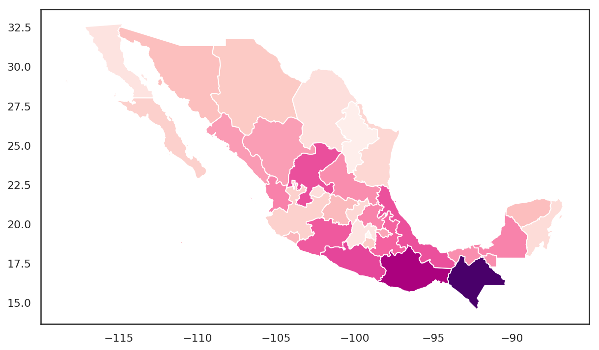

## What is geographic data? 

* Thus far: we've been working with data (largely) in tabular data frames, where each column represents data "attributes"
* Geographic data: includes information on _location_ - specifically, where the observation is located on the Earth's surface

---

### Maps!

<iframe src=http://personal.tcu.edu/kylewalker/maps/dfw_election.html height = "600" width = "900" frameborder = "0"></iframe>

---

### Longitude and latitude: the basics


---

### Geographic coordinates

* Longitude (X) and latitude (Y) coordinates can be expressed as:
  + Degrees minutes seconds (e.g. $97^{\circ}21'37''W$, $32^{\circ}42'38''N$)
  + Decimal degrees (e.g. $-97.36$, $32.71$)

Conversion between DMS and decimal degrees:

$$DD = D + \frac{M}{60} + \frac{S}{3600}$$

---

## Coordinate systems

* __Geographic coordinate system__: coordinate system based on latitude and longitude (coordinates on a sphere)
* __Projected coordinate system__: coordinate system projected onto a two-dimensional surface (coordinates on a plane)
* Example: http://bl.ocks.org/mbostock/raw/5731632

---

## Map projections

<iframe src="http://personal.tcu.edu/kylewalker/introgis/projections.html" width = "900" height = "700" frameBorder = "0"></iframe><figcaption>Original source: Mike Bostock</figcaption>

---

### Tiled mapping and Web Mercator


---

### Map projections and distortion

Examples: 

* http://bl.ocks.org/curran/raw/01aa2685f083b6c1b9fb
* http://bl.ocks.org/enjalot/raw/bd552e711b8325c64729

---

## Vector data


---

## Raster data


---

### Vector data: CSV files

* Example: Starbucks locations in Chicago 
* Data download: http://personal.tcu.edu/kylewalker/data/chicago_starbucks.csv

---

### Let's make a map!

* CARTO: https://carto.com/signup
* CARTO (free) student edition: https://carto.com/students-access/

---

### Mapping point data

<iframe width="100%" height="600" frameborder="0" src="https://kwalkertcu-demo.carto.com/builder/0c04cfaa-ab41-11e6-95be-0e3ebc282e83/embed" allowfullscreen webkitallowfullscreen mozallowfullscreen oallowfullscreen msallowfullscreen></iframe>

---

### Vector data: the _shapefile_

* __Shapefile__: common format for encoding vector geographic data
* Three __required__ files: .shp, .dbf, and .shx; .prj recommended  


---

### Vector data: GeoJSON

* [Mexico's states as GeoJSON](https://gist.github.com/walkerke/76cb8cc5f949432f9555)

---

### Mapping polygons

```python
import geopandas as gp

mxgeo = gp.read_file("https://gist.githubusercontent.com/walkerke/76cb8cc5f949432f9555/raw/363c297ce82a4dcb9bdf003d82aa4f64bc695cf1/mx.geojson")


sns.set(style = "white", rc = {"figure.figsize": (10, 8)})
mxgeo.plot(column = "pri10", cmap = "RdPu")
```

---

### Mapping polygons



---

### Mapping polygons (CARTO)

<iframe width="100%" height="600" frameborder="0" src="https://kwalkertcu.cartodb.com/viz/a70f62c4-8b00-11e5-8960-0e5db1731f59/embed_map" allowfullscreen webkitallowfullscreen mozallowfullscreen oallowfullscreen msallowfullscreen></iframe>

---

### Should you map? 

* Beware the "amazing map"...

<figcaption>Source: [Clickhole (The Onion)](http://www.clickhole.com/article/we-put-700-red-dots-map-947)</figcaption>

---

### Maps vs. charts

* For discussion: which visualization is more effective for showing differences in our data?   

---

### Chart for comparison


---

### Code to reproduce the chart

```python
import pandas as pd, seaborn as sns, matplotlib.pyplot as plt
sns.set(style="whitegrid")
df = pd.read_csv("http://personal.tcu.edu/kylewalker/mexico.csv")

plt.figure(figsize = (10, 8))

p = sns.stripplot(data = df.sort_values('pri10', ascending = False), 
                  x = 'pri10', y = 'name', palette = "RdPu_d", 
                  orient = 'h', size = 8)
p.set(xlabel = "% of workforce in primary sector", 
      xlim = (0, 50), ylabel = "")
p.axes.xaxis.grid(False)
p.axes.yaxis.grid(True)
sns.despine(left = True, bottom = True)

```


<style>

.reveal section img {
  background:none; 
  border:none; 
  box-shadow:none;
  }

h3 {


}
  
</style>

